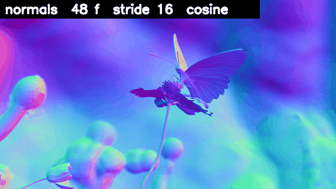
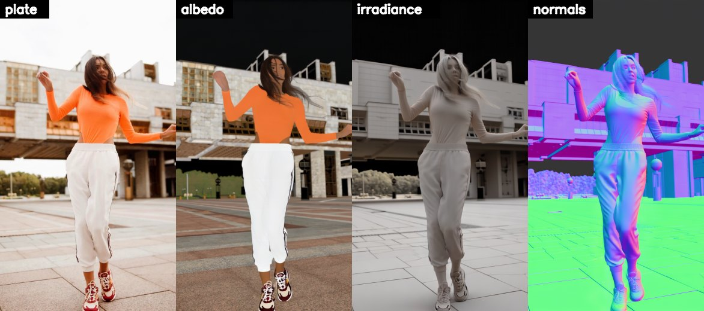

# ComfyUI-UniVidX

Turn video plates into albedo, irradiance, normals and mattes for VFX compositing.

For compositors, lighting artists and VFX pipelines taking generated AOVs into Nuke.
Pair UniVidX with ComfyUI-Gamut for an EXR-native, colour-managed handoff: prepare the plate in display-referred sRGB, then export colour and signed vector passes with explicit declarations.

[](LICENSE)
[](vendor/univid/LICENSE)
[](https://github.com/pttsonev/ComfyUI-UniVidX)
[](pyproject.toml)
[](pyproject.toml)


**Temporal consistency at a glance** — a 48-frame normals pass.



<details>
<summary>Vertical plate — the same pass layout</summary>



</details>

## 🎬 What you get

- Decompose plates into aligned `rgb`, `albedo`, `irradiance` and `normal` passes.
- Extract composite / alpha / foreground / background with the alpha model family.
- Select among 30 upstream tasks for conditioning or generation.
- Blend overlapping context windows during denoising for local temporal continuity.
- Use SageAttention, shared K/V and adjustable model residency for shot-length work.
- Send passes to Gamut's multilayer or data-channel EXR writers for Nuke.

## Quick start

Clone [this pack](https://github.com/pttsonev/ComfyUI-UniVidX) into `ComfyUI/custom_nodes/ComfyUI-UniVidX`, or junction that folder to your checkout. Install dependencies with **ComfyUI's Python**, then restart ComfyUI:

```sh
cd ComfyUI/custom_nodes/ComfyUI-UniVidX
python -m pip install -r requirements.txt
```

Install a compatible `sageattention` package for the default `attention=sage`, or select `sdpa`. Missing SageAttention is reported as an error. `modelscope` is required by upstream imports even though this pack downloads nothing.

**Place models yourself under `ComfyUI/models/`.** The loader discovers them through `folder_paths` and validates their contents, including complete shard sets.

<details>
<summary>Model folders and filenames</summary>

| Model | Folder under `ComfyUI/models/` | File / format |
|---|---|---|
| Wan2.1-T2V-14B DiT | `diffusion_models/` and subfolders | BF16 six-shard set or scaled FP8 single file, e.g. `Wan2_1-T2V-14B_fp8_e4m3fn_scaled_KJ.safetensors` |
| Wan2.1 VAE | `vae/` | `wan_2.1_vae.safetensors` |
| umt5-xxl text encoder | `text_encoders/` | `umt5-xxl-enc-bf16.safetensors` |
| UniVidX intrinsic / alpha checkpoints | `unividx/` | `univid_intrinsic.safetensors`, `univid_alpha.safetensors` (~1.6 GB total) |
| umt5 tokenizer | `unividx/umt5-xxl/` | Tokenizer directory |
| Optional LightX2V rank-64 LoRA | `loras/` | `Wan21_T2V_14B_lightx2v_cfg_step_distill_lora_rank64.safetensors` (~600 MB) |

Obtain the intrinsic and alpha weights from [the UniVidX model repository](https://huggingface.co/houyuanchen/UniVidX). `umt5_xxl_fp16.safetensors` and the Wan2.2 VAE are incompatible look-alikes and are refused.

</details>

Wire this intrinsic graph using the node names below:

```text
UniVidX: Load Model (intrinsic) + UniVidX: Select Task (R2AIN) → UniVidX: Sampler
Display-referred sRGB plate → Sampler.rgb; choose dimensions and frame count
Sampler.result → UniVidX: Decode Intrinsic → rgb / albedo / irradiance / normal codes
Normal codes → Gamut: Normal Decode; colour + signed normal → Gamut: Save Multilayer EXR
```

**Input contract:** display-referred sRGB frames in `[0,1]`, with `input_encoding=display_referred_srgb`. For linear, wide-gamut or HDR plates, use **Gamut: Load EXR** with `tonemap_preview=True` first; it decodes the transfer, rotates to Rec.709, clips and sRGB-encodes. Keep the sampler on `display_referred_srgb` after that conversion.

<details>
<summary>Colour and normal handoff</summary>

- `linear_rec709_to_srgb` accepts only scene-linear Rec.709 in `[0,1]`; it applies a transfer curve, without rotating primaries or compressing HDR. Upstream does not specify its training-side EXR transform; the display contract follows its inference video loader.
- Colour encoding affects `rgb`, `albedo`, `irradiance`, `fgr` and `bgr`; normals and mattes never receive a colour transfer. Declare the actual colour encoding when saving; `[0,1]` alone does not mean linear.
- **Normals are signed, camera-space OpenGL, outward: +X right, +Y up, +Z toward camera.** The sampler holds signed values; Decode Intrinsic maps them to IMAGE codes with `x * 0.5 + 0.5`. Gamut: Normal Decode reverses this with `(x - 0.5) * 2` before EXR export. Never clip signed normals to `[0,1]` or colour-manage them.
- For separate vectors, use **Gamut: Save Data EXR**; it writes data channels without colour metadata. For a mixed multilayer file in Nuke, read as Raw Data, Shuffle the passes and convert only colour branches to the show's working space.
- Decode Alpha returns `rgb / pha / fgr / bgr` (composite / alpha / fg / bg), all IMAGEs. To attach `pha` as opacity in Gamut, use `alpha_image` with `alpha_channel=R`.

</details>

## Nodes

Find these under `UniVidX/Models`, `UniVidX/Tasks`, `UniVidX/Sampling` and `UniVidX/Decode`.

| Node | What it does | Key widgets |
|---|---|---|
| UniVidX: Load Model | Discover weights and cache the selected model | `variant=intrinsic`, `compute_dtype=bfloat16`, `distillation=none`, `num_persistent_param_in_dit=2e9` |
| UniVidX: Select Task | Choose inputs and generated modalities | `mode=R2AIN` |
| UniVidX: Sampler | Fit conditioning and run the selected task | `steps`, `input_encoding`, `attention`, `context_enabled`, `context_blend`, `rope_precision` |
| UniVidX: Decode Intrinsic | Return aligned rgb / albedo / irradiance / normal IMAGEs | No widgets; connect `result` |
| UniVidX: Decode Alpha | Return aligned rgb / pha / fgr / bgr IMAGEs | No widgets; connect `result` |

## Production recipe

Measured **2026-09-13**, RTX 5090, **704x1248, 189 frames**: **26:17 total**, **28.9 s per window-step**, **15.2 GiB peak** with SageAttention 2.2.0. Set the overrides below to reproduce it; the full recipe is not the default configuration.

| Control | Measured recipe | Node default |
|---|---|---|
| Model / task | `intrinsic`, `R2AIN`, `bfloat16` | Same |
| Loader distillation / sampler steps | `distillation=lightx2v`, `distillation_strength=1.0`, `steps=4` | `none`, `1.0`, `50` |
| Prompt / CFG / seed | Empty prompt, effective CFG `1.0`, seed `0` | Empty prompt forces `1.0` despite widget `5.0`; seed `0` |
| Width / height / frames | `704` / `1248` / `189` | `640` / `480` / `21` |
| Context | Enabled; window `21`, stride `16`, blend `cosine` | Disabled; same window / stride / blend |
| Attention / shared K/V / RoPE | `sage` / `shared_kv=True` / `float32` | Same |
| DiT residency / VRAM limit | `num_persistent_param_in_dit=2e9`, `vram_limit=0` (unset) | Same |
| VAE | `tiled=True`, `tiled_encode=False` | Same |

**LightX2V is off by default:** it was trained on natural video, and normals and alpha are the highest-risk outputs under distillation. Review a short shot before adopting the recipe. SDPA is **2.4–6x slower per attention call** in the supplied measurements; this is not an end-to-end speed ratio.

<details>
<summary>Long clips, continuity and memory controls</summary>

Use `num_frames % 4 == 1`; upstream rounds other counts upward and repeats the last input frame when needed. At window `21` / stride `16`, 189 frames uses 12 windows per denoising step. Frame fitting and window counts are reported.

Choose a smaller stride for more overlap and processing time. Blend options are `cosine`, `triangular`, `flat` and `sharp`; windows improve local continuity without giving the model global shot awareness. The reference operating point remains 21 frames at 640x480.

**Never set the residency cap to `4e9` with SageAttention 2.2.0 on a 32 GB card: it pages.** Use `2e9` for the measured recipe or `0` to stream the whole DiT. The cap and a nonzero `vram_limit` are mutually exclusive; `-1` leaves the cap unset. Lower residency changes wall time, not weights.

VAE decode tiling defaults to latent tiles `30x52`, strides `15x26`; strides must be smaller than tile sizes. Enable `tiled_encode` only if conditioning encode runs out of memory. Interrupt is checked before each prediction and context window.

</details>

## Hardware

CUDA is required; the loader refuses CPU and probes a real GPU kernel before loading weights. Times below refer to the 704x1248, 189-frame, LightX2V 4-step recipe.

| GPU | Basis | Time per 189 frames | Residency guidance |
|---|---|---|---|
| RTX 5090 32 GB | Measured | ~26 min (26:17) | Cap `2e9`; 15.2 GiB peak |
| RTX A5000 24 GB | Projection | ~60–65 min | Cap `0`; ≥64 GB host RAM |
| RTX PRO 6000 Blackwell 96 GB | Projection | ~15–17 min | Full residency |

## Boundaries & licence

UniVidX decomposes plates; it does not relight them or guarantee that albedo × irradiance reconstructs the source. Use the outputs as estimated passes for shot review.

The pack is [MIT](LICENSE). Vendored [houyuanchen111/UniVidX](https://github.com/houyuanchen111/UniVidX) and its published intrinsic/alpha weights are Apache-2.0; the snapshot is pinned in [VENDOR.md](vendor/univid/VENDOR.md) and never edited. Model loading uses ComfyUI paths; runtime adaptations live in this pack. Model files are human-placed and retain their own licences. No GPL third-party wrapper code is included; see [NOTICE](NOTICE).

## Development

From this pack's directory:

```sh
python -m pytest tests -q
```

363 offline tests; no torch needed. Changes receive independent review in a fresh thread, with corrections reviewed until `APPROVED` before the integration PR.

---

Built on [UniVidX](https://github.com/houyuanchen111/UniVidX), Wan2.1 and DiffSynth-Studio. EXR handoff by [ComfyUI-Gamut](https://github.com/pttsonev/ComfyUI-Gamut).
